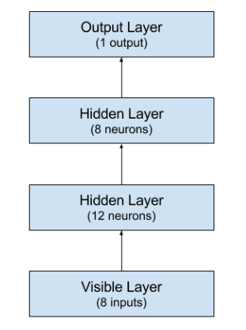

PIMA Indian Diabetes Prediction
=====

Evaluation of a multilayer-perceptron model
---

We are going to use the Pima Indians onset of diabetes dataset from the UCI Machine Learning Repository for the binary classification problem of onset of diabetes or not (1 or 0). 

Input variables for the dataset are: 

1. Number of times pregnant
2. Plasma concentration
3. Diastolic BP
4. Triceps skin fold thickness
5. 2-Hour serum insulin
6. Body Mass Index
7. Diabetes Pedigree Function
8. Age
9. Class, Onset of diabetes

Data is imported from the file `dataset.csv`

Dependencies include:
----
1. `numpy`
2. `keras`
3. `tensorflow` or `theano` as backend

Architecture of the Network
---
We use a `Sequential` model from keras. We're going to use a fully connected network with three layers. 

We use the rectifier (`relu`) activation function on the first two layers and the `sigmoid` actiivation function in the output layer. 

There are 8 inputs to the network, the first hidden layer has 12 neurons and the second hidden layer has 8 neurons. The output layer has 1 neuron to predict the class. 

Loss function is `binary_crossentropy` and the `adam` optimizer is used. Number of epochs is 150 with a batch size of 10. 

Evaluation 
---
The model gives an approximate accuracy of prediction as 78.35%

